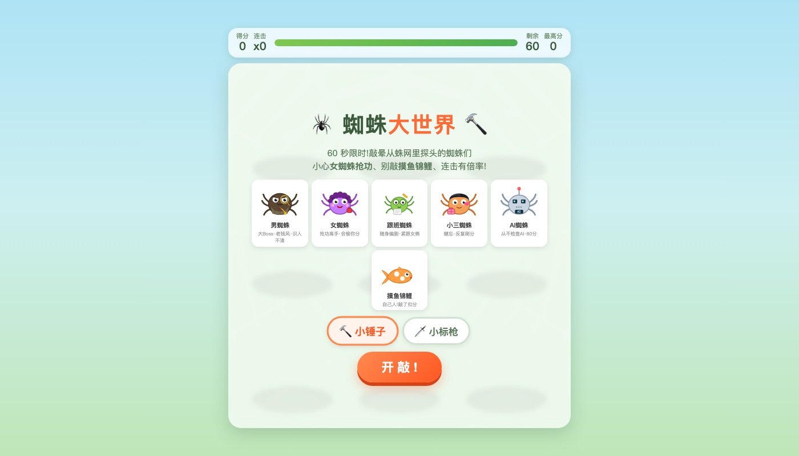

# Keying's Lab 🎨

**👉 作品集首页：https://keyingquan.github.io/hello-world/**（AI短剧生产策略与平台运营 · 专业作品 + 互动 Demo）

权可莹的个人作品集 —— 用 AI 协作开发的方式，把想法快速做成能玩的东西。

> 我的主业是 AI 短剧内容策略（成片质检工作流 / 爆款拆解 / 内容 SOP），这里放的是我用 AI 编程工具（Claude 等）从 0 到 1 落地的交互作品。想法、产品定义、迭代验收是我的；代码是我指挥 AI 写的——这正是我理解的 AI 时代内容人的工作方式。

## 专业作品

- [AI 短剧成片自动化质检工作流（脱敏版）](https://keyingquan.github.io/hello-world/works/ai-qc-workflow.html)
- [短剧内容质量判断标准 · 方法论一页](https://keyingquan.github.io/hello-world/works/content-quality.html)

## 在线体验（GitHub Pages）

### 🖐 手势粒子宇宙 · Hand Particle Universe

**[▶ 在线体验](https://keyingquan.github.io/hello-world/hand-particles.html)**（需允许摄像头权限，建议 Chrome / Edge）

摄像头手势控制的 3D 粒子系统：爱心 / 花朵 / 土星 / 烟花 / 地球 / 千里江山 / 昙花 七种形态，手掌张合缩放、握拳聚拢、单指左右摇摆旋转、前后拉近拉远。粒子颜色、细腻度、亮度实时可调。

- 技术要点：MediaPipe 手势识别 + WebGL 粒子渲染，纯前端单文件，无需安装

### 🕷 蜘蛛大世界 · 解压打蛛小游戏

**[▶ 在线体验](https://keyingquan.github.io/hello-world/spider-world/)**

60 秒限时打地鼠玩法 + 办公室摸鱼宇宙观：男蜘蛛（大 Boss·老钱风）、女蜘蛛（抢功高手）、跟班蜘蛛、小三蜘蛛、AI 蜘蛛（从不检查 AI·80 分），小心别敲到摸鱼锦鲤。连击有倍率，支持小锤子 / 小标枪两种武器。

## 关于我

- 现任网眼科技（WebEye）内容策略：海内外短剧合规 + 趋势洞察 + AI 成片质检工作流（多模态大模型 8 类目逐集审查，3 周从 0 到 1，token 成本 -87%）
- 前字节跳动短剧内容运营：万级爆款剧本拆解
- 联系：quankeying540@gmail.com
